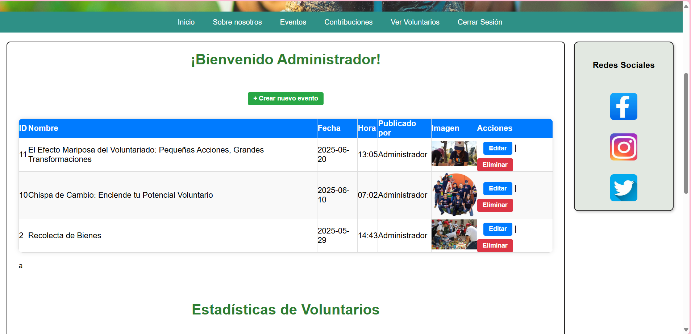
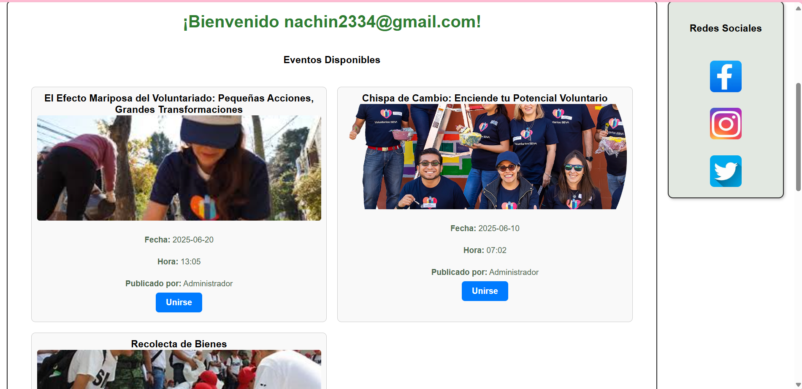

# Aplicación Web para ONG

Una plataforma desarrollada como proyecto académico en la materia de **Programación Web**, enfocada en apoyar la gestión de eventos, voluntarios y contribuciones en una organización sin fines de lucro.

## Descripción

Esta aplicación permite a las fundaciones organizar eventos, registrar voluntarios, gestionar contribuciones y brindar un entorno transparente y eficiente para sus operaciones sociales. Con roles diferenciados de usuario (administrador y voluntario), permite controlar accesos, ver dashboards de impacto y mantener una comunicación clara dentro de la comunidad.

##  Funcionalidades principales

- Registro e inicio de sesión con autenticación segura
- Gestión de eventos comunitarios (crear, consultar, inscribirse)
- Registro de contribuciones 
- Asociación de voluntarios a eventos con historial visible
- Dashboards con métricas de participación (solo para administradores)
- Diseño responsivo adaptable a dispositivos móviles

## Tecnologías utilizadas

- **Frontend:** HTML5, CSS3, JavaScript
- **Backend:** PHP
- **Base de datos:** MySQL
- **Frameworks/librerías:** Chart.js, Bootstrap
- **Control de versiones:** Git + GitHub

##  Requisitos previos

Antes de comenzar, asegúrate de tener instalado:

- [XAMPP](https://www.apachefriends.org/index.html) o similar (para entorno PHP y MySQL)
- Git (opcional, para clonar el repositorio)

## Instrucciones de instalación

1. **Clona el repositorio**

   ```bash
   git clone https://github.com/china153/Proyecto-Fundacion.git
   ```

   O descarga el repositorio como archivo ZIP y extráelo.

2. **Coloca el proyecto en tu servidor local**

   Copia la carpeta del proyecto en el directorio `htdocs` de XAMPP:

   ```
   C:/xampp/htdocs/proyecto-ong
   ```

3. **Importa la base de datos**

   - Abre `phpMyAdmin` desde el panel de XAMPP.
   - Crea una base de datos (por ejemplo, `tsito1`).
   - Importa el script de base de datos ubicado en:  
     `C:\xampp\htdocs\fundacionC\tsito1.sql`

4. **Configura la conexión a la base de datos**

   Edita el archivo `config/conexion.php` y actualiza las credenciales según tu entorno local:

   ```php
   $host = "localhost";
   $user = "root";
   $pass = "";
   $db   = "tsito1";
   ```

5. **Ejecuta la aplicación**

   Abre tu navegador y accede a:

   ```
   http://localhost/fundacionC
   ```

## 📷 Capturas de pantalla

Funcionamiento de:


- Registro de usuario  
   

- Panel de administrador  
   

- Inscripción a eventos
   

- Dashboard de métricas
   

## Mapa de navegación

- **Administrador:** acceso a creación de eventos, dashboard, gestión de voluntarios
- **Voluntario:** inscripción a eventos, perfil personal, historial de participación

##  Créditos

**Proyecto desarrollado por estudiantes del Tecnológico Nacional de México - Campus Orizaba:**

- Hernández Ramos Vicente 
- Murguia Morales Alma Karen  
- Vázquez Arriaga Ángel Ignacio  
- Vázquez González Mariana 
- Vera Llave Yesua Isidro  

**Catedrática:**  
Patricia Quitl González

## 📄 Licencia

Este proyecto es de uso académico y sin fines de lucro. Libre para su modificación con fines educativos.
